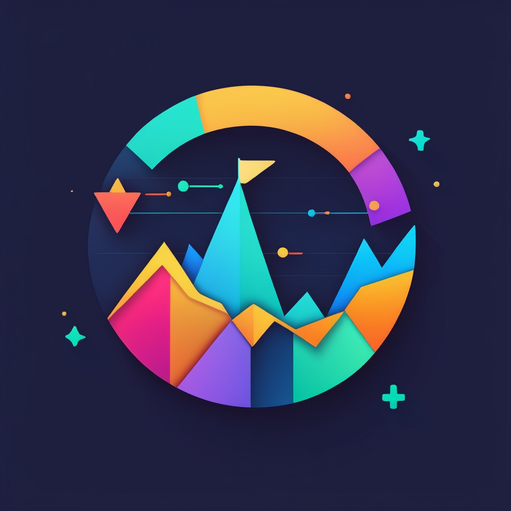

# DayTView
DayTrading View
<!-- Improved compatibility of back to top link: See: https://github.com/othneildrew/Best-README-Template/pull/73 -->

<!--
*** Thanks for checking out the Best-README-Template. If you have a suggestion
*** that would make this better, please fork the repo and create a pull request
*** or simply open an issue with the tag "enhancement".
*** Don't forget to give the project a star!
*** Thanks again! Now go create something AMAZING! :D
-->

<!-- PROJECT SHIELDS -->
<!--
*** I'm using markdown "reference style" links for readability.
*** Reference links are enclosed in brackets [ ] instead of parentheses ( ).
*** See the bottom of this document for the declaration of the reference variables
*** for contributors-url, forks-url, etc. This is an optional, concise syntax you may use.
*** https://www.markdownguide.org/basic-syntax/#reference-style-links
-->
[![Contributors][contributors-shield]][contributors-url]
[![Stargazers][stars-shield]][stars-url]
[![Issues][issues-shield]][issues-url]

<!-- PROJECT LOGO -->
 

  

  <h3 align="center">Day-Trading-View</h3>

  

    An awesome designed App to aid traders in making informed intraday trading decisions!
     
    <a href="https://github.com/seanzhang328/DayTView"><strong>Explore the docs »</strong></a>
     
     
    <a href="https://github.com/seanzhang328/DayTView">View Demo</a>
    ·
    <a href="https://github.com/seanzhang328/DayTView/issues">Report Bug</a>
    ·
    <a href="https://github.com/seanzhang328/DayTView/issues">Request Feature</a>
  

<!-- TABLE OF CONTENTS -->

  
Table of Contents

  <ol>
    <li>
      <a href="#about-the-project">About The Project</a>
      <ul>
        <li><a href="#built-with">Built With</a></li>
      </ul>
    </li>
    <li>
      <a href="#getting-started">Getting Started</a>
      <ul>
        <li><a href="#prerequisites">Prerequisites</a></li>
        <li><a href="#installation">Installation</a></li>
      </ul>
    </li>
    <li><a href="#usage">Usage</a></li>
    <li><a href="#roadmap">Roadmap</a></li>
    <li><a href="#contributing">Contributing</a></li>
    <li><a href="#license">License</a></li>
    <li><a href="#contact">Contact</a></li>
    <li><a href="#acknowledgments">Acknowledgments</a></li>
  </ol>

<!-- ABOUT THE PROJECT -->
## About The Project

[![Product Name Screen Shot][product-screenshot]](https://example.com)

After searching for tools that could assist me in intraday trading, I found that many lacked the intuitive design and actionable insights I needed. That's why I built DayTView, an app that combines my real trading experience with a user-friendly interface.

### Why DayTView?

- **Real-World Insights:** This app isn't built on hypothetical scenarios; it's based on real trading experience.
- **Intuitive Design:** No need to interpret complex charts. The color-coding provides instant insights.
- **Focus on What Matters:** Stop wasting time on inefficient tools and focus on making better trading decisions.

## Key Features

1. **Intuitive Trend Indicators:** The color of line segments indicates current short-term and long-term trends.
2. **Background Color Insights:** Understand the prevailing market technical trends essential for intraday trading. For example, a yellow background suggests a subdued trend.
3. **Robust Trend Identification:** A change in the line chart color that aligns with the background denotes a strong market trend in a particular direction.

(<a href="#readme-top">back to top</a>)

### Built With

Major frameworks/libraries used to bootstrap this project.

* [SwiftUI][SwiftUI-url]

(<a href="#readme-top">back to top</a>)

<!-- GETTING STARTED -->
## Getting Started

Download the App at Apple AppStore.

<!-- USAGE EXAMPLES -->
## Usage

Use this space to show useful examples of how a project can be used. Additional screenshots, code examples and demos work well in this space. You may also link to more resources.

_For more examples, please refer to the [Documentation](https://example.com)_

(<a href="#readme-top">back to top</a>)

<!-- ROADMAP -->
## Roadmap

- [x] Add Changelog
- [x] Add back to top links
- [ ] Add Additional Templates w/ Examples
- [ ] Add "components" document to easily copy & paste sections of the readme
- [ ] Multi-language Support
    - [ ] Chinese
    - [ ] Spanish

See the [open issues](https://github.com/othneildrew/Best-README-Template/issues) for a full list of proposed features (and known issues).

(<a href="#readme-top">back to top</a>)

<!-- CONTACT -->
## Contact

Sean Zhang - [@your_twitter](https://twitter.com/your_username) - email@example.com

Project Link: [https://github.com/your_username/repo_name](https://github.com/your_username/repo_name)

(<a href="#readme-top">back to top</a>)

<!-- ACKNOWLEDGMENTS -->
## Acknowledgments

Use this space to list resources you find helpful and would like to give credit to. I've included a few of my favorites to kick things off!

* [Choose an Open Source License](https://choosealicense.com)
* [GitHub Emoji Cheat Sheet](https://www.webpagefx.com/tools/emoji-cheat-sheet)
* [Malven's Flexbox Cheatsheet](https://flexbox.malven.co/)
* [Malven's Grid Cheatsheet](https://grid.malven.co/)
* [Img Shields](https://shields.io)
* [GitHub Pages](https://pages.github.com)
* [Font Awesome](https://fontawesome.com)
* [React Icons](https://react-icons.github.io/react-icons/search)

(<a href="#readme-top">back to top</a>)

<!-- MARKDOWN LINKS & IMAGES -->
<!-- https://www.markdownguide.org/basic-syntax/#reference-style-links -->
[contributors-shield]: https://img.shields.io/github/contributors/seanzhang328/DayTView.svg?style=for-the-badge
[contributors-url]: https://github.com/seanzhang328/DayTView/graphs/contributors
[stars-shield]: https://img.shields.io/github/stars/seanzhang328/DayTView.svg?style=for-the-badge
[stars-url]: https://github.com/seanzhang328/DayTView/stargazers
[issues-shield]: https://img.shields.io/github/issues/seanzhang328/DayTView.svg?style=for-the-badge
[issues-url]: https://github.com/seanzhang328/DayTView/issues
[product-screenshot]: images/ScreenSnap-white.png
[SwiftUI-url]: https://developer.apple.com/xcode/swiftui/ 
