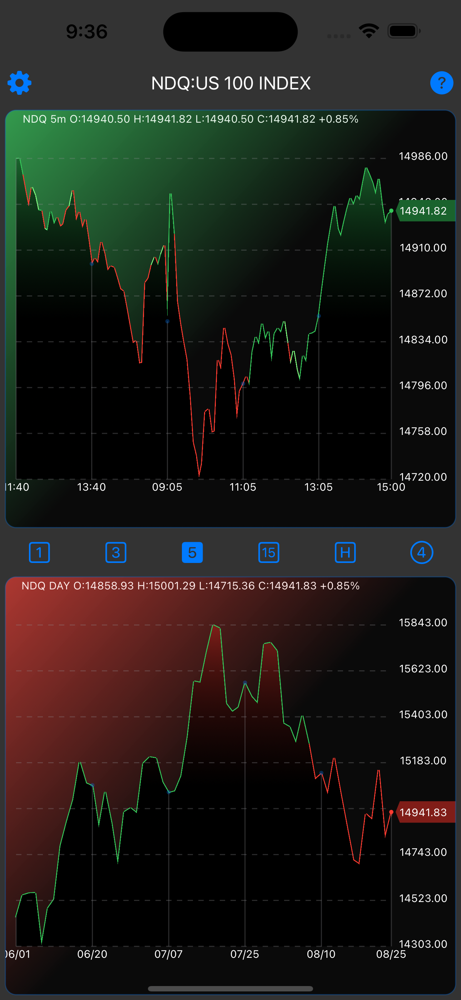
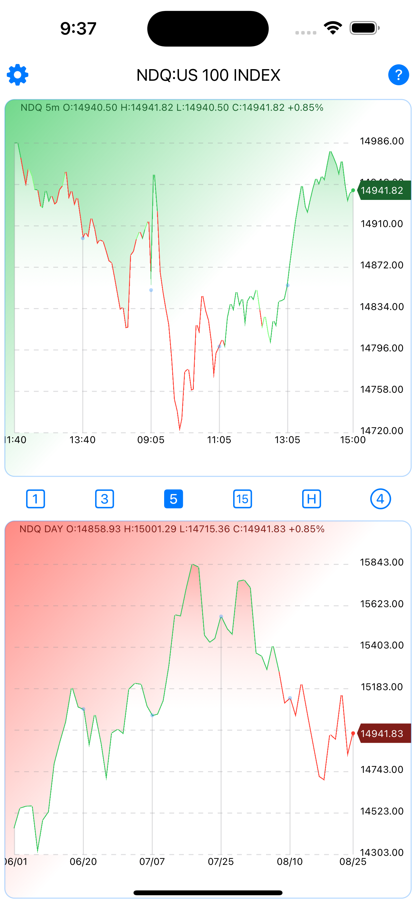
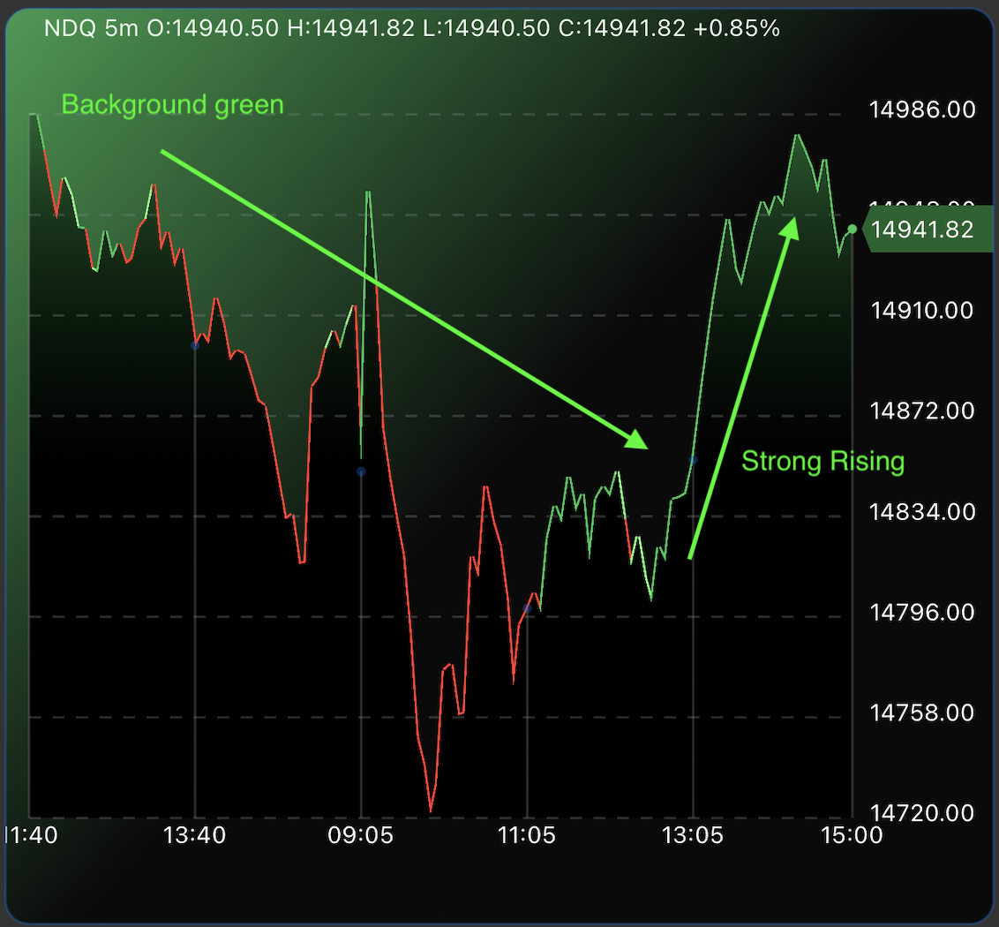

# DayTView
DayTrading View
<!-- Improved compatibility of back to top link: See: https://github.com/othneildrew/Best-README-Template/pull/73 -->

<!--
*** Thanks for checking out the Best-README-Template. If you have a suggestion
*** that would make this better, please fork the repo and create a pull request
*** or simply open an issue with the tag "enhancement".
*** Don't forget to give the project a star!
*** Thanks again! Now go create something AMAZING! :D
-->

<!-- PROJECT SHIELDS -->
<!--
*** I'm using markdown "reference style" links for readability.
*** Reference links are enclosed in brackets [ ] instead of parentheses ( ).
*** See the bottom of this document for the declaration of the reference variables
*** for contributors-url, forks-url, etc. This is an optional, concise syntax you may use.
*** https://www.markdownguide.org/basic-syntax/#reference-style-links
-->
[![Contributors][contributors-shield]][contributors-url]
[![Stargazers][stars-shield]][stars-url]
[![Issues][issues-shield]][issues-url]

<!-- PROJECT LOGO -->
 

  

  <h3 align="center">Day-Trading-View</h3>

  

    An awesome designed App to aid traders in making informed intraday trading decisions!
     
    <a href="https://github.com/seanzhang328/DayTView"><strong>Explore the docs »</strong></a>
     
     
    <a href="https://github.com/seanzhang328/DayTView">View Demo</a>
    ·
    <a href="https://github.com/seanzhang328/DayTView/issues">Report Bug</a>
    ·
    <a href="https://github.com/seanzhang328/DayTView/issues">Request Feature</a>
  

<!-- TABLE OF CONTENTS -->

  
Table of Contents

  <ol>
    <li>
      <a href="#about-the-project">About The Project</a>
      <ul>
        <li><a href="#built-with">Built With</a></li>
      </ul>
    </li>
    <li>
      <a href="#getting-started">Getting Started</a>
      <ul>
        <li><a href="#prerequisites">Prerequisites</a></li>
        <li><a href="#installation">Installation</a></li>
      </ul>
    </li>
    <li><a href="#usage">Usage</a></li>
    <li><a href="#roadmap">Roadmap</a></li>
    <li><a href="#contributing">Contributing</a></li>
    <li><a href="#license">License</a></li>
    <li><a href="#contact">Contact</a></li>
    <li><a href="#acknowledgments">Acknowledgments</a></li>
  </ol>

<!-- ABOUT THE PROJECT -->
## About The Project

  
  

After searching for tools that could assist me in intraday trading, I found that many lacked the intuitive design and actionable insights I needed. That's why I built DayTView, an app that combines my real trading experience with a user-friendly interface.

### Why DayTView?

- **Real-World Insights:** This app isn't built on hypothetical scenarios; it's based on real trading experience.
- **Intuitive Design:** No need to interpret complex charts. The color-coding provides instant insights.
- **Focus on What Matters:** Stop wasting time on inefficient tools and focus on making better trading decisions.

## Key Features

1. **Intuitive Trend Indicators:** The color of line segments indicates current short-term and long-term trends.
2. **Background Color Insights:** Understand the prevailing market technical trends essential for intraday trading. For example, a yellow background suggests a subdued trend.
3. **Robust Trend Identification:** A change in the line chart color that aligns with the background denotes a strong market trend in a particular direction.
4. **Easy to use symbol list:** Easy add symbol with exchange name. Drag to change the order, swipe to delete.
5. **TradingView Integration:** Using your TradingView login credentials or web browser sessionid in the cookies, the App can get the read-time quotes from the TradingView.
6. **Support Dark Mode:** This App can automatically follow the system dark mode settings.

(<a href="#readme-top">back to top</a>)

### Built With

Major frameworks/libraries used to bootstrap this project.

* [SwiftUI][SwiftUI-url]

(<a href="#readme-top">back to top</a>)

<!-- GETTING STARTED -->
## Getting Started

Download the App at Apple AppStore: [https://apps.apple.com/us/app/daytview/id6463077574]

<!-- USAGE EXAMPLES -->
## Usage

<table border="0" style="border-collapse: collapse; border: none;">
  <tr style="border: none;">
    <td style="border: none;" width="500">
      
    </td>
    <td style="border: none; vertical-align:top;">
      <h3>Usage 1:</h3>
      

        <ol>
          <li>The color of line segments intuitively indicates current short-term and long-term trends.</li>
          <li>Background colors provide insights into the prevailing market technical trends. This is essential for intraday trading, helping traders discern potential trends. For instance, a yellow background suggests a subdued trend for the day.</li>
        </ol>
      

    </td>
  </tr>
    <tr style="border: none;">
    <td style="border: none;" width="500">
      
    </td>
    <td style="border: none; vertical-align:top;">
      <h3>Usage 2:</h3>
      

        <ol>
          <li>A change in the line chart color that aligns with the background denotes a robust trend. Such convergence is a signal of market strength in a particular direction.</li>
          <li>Viewing both intraday and daily charts at the same time gives you a more accurate picture of intraday trends</li>
        </ol>
      

    </td>
  </tr>
</table>

(<a href="#readme-top">back to top</a>)

<!-- ROADMAP -->
## Roadmap

- [x] Do Sandbox Test
- [x] Do TestFlight
- [x] Project Readme
- [ ] Add "FAQ" to document
- [ ] Multi-language Support
    - [ ] Chinese
    - [ ] Spanish

See the [open issues](https://github.com/seanzhang328/DayTView/issues) for a full list of proposed features (and known issues).

(<a href="#readme-top">back to top</a>)

<!-- CONTACT -->
## Contact

Sean Zhang - seanzhang328 .at. gmail.com

Project Link: [https://github.com/SeanZhang328/DayTView](https://github.com/SeanZhang328/DayTView)

(<a href="#readme-top">back to top</a>)

<!-- ACKNOWLEDGMENTS -->
## Acknowledgments

The resources I find helpful and would like to give credit to:

* [ChatGPT](https://chat.openai.com)

(<a href="#readme-top">back to top</a>)

<!-- MARKDOWN LINKS & IMAGES -->
<!-- https://www.markdownguide.org/basic-syntax/#reference-style-links -->
[contributors-shield]: https://img.shields.io/github/contributors/seanzhang328/DayTView.svg?style=for-the-badge
[contributors-url]: https://github.com/seanzhang328/DayTView/graphs/contributors
[stars-shield]: https://img.shields.io/github/stars/seanzhang328/DayTView.svg?style=for-the-badge
[stars-url]: https://github.com/seanzhang328/DayTView/stargazers
[issues-shield]: https://img.shields.io/github/issues/seanzhang328/DayTView.svg?style=for-the-badge
[issues-url]: https://github.com/seanzhang328/DayTView/issues
[product-screenshot]: images/ScreenSnap-white.png
[SwiftUI-url]: https://developer.apple.com/xcode/swiftui/ 
